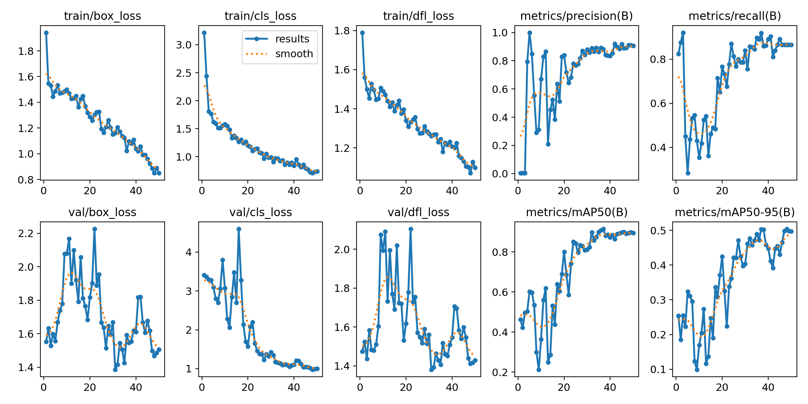
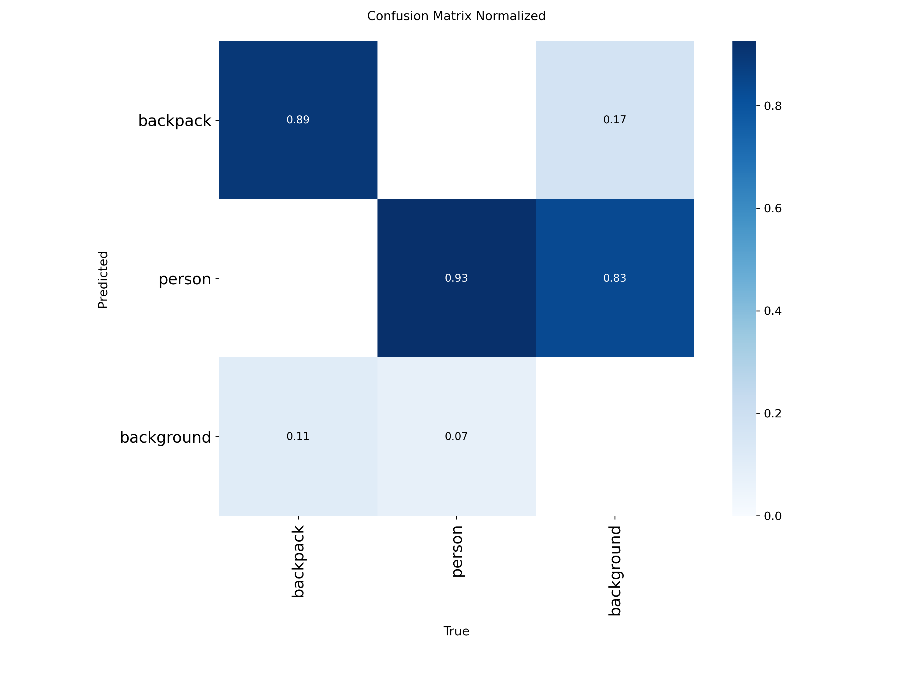

# Infiray P2 Pro - AI Thermal Camera Project

**Project from the Accenture-UFPE Innovation Center Rotation**

This project provides a complete pipeline for using the InfiRay P2 Pro thermal camera to train and deploy a YOLOv8 object detection model for anomaly detection. The initial goal is to efficiently capture the camera's feed for use in AI models and industrial applications.

---

## Features

- **Real-time Anomaly Detection:** Detects `people` and `backpacks` from a thermal camera feed.
- **Complete ML Pipeline:** Scripts for data preparation, training, and inference.
- **Extensible:** Built with YOLOv8, easy to train on new custom objects.

---

## Project Structure

The project is organized to separate code, data, and results for clarity and ease of use.

```
/
├── .gitignore                # Files to ignore in git
├── README.md                 # This guide
├── requirements.txt          # Project dependencies
├── data.yaml                 # YOLO dataset configuration
├── yolov8n.pt                # Base model for reproducibility
│
├── src/                      # All project source code
│   ├── data_preparation/     # Scripts to process raw data
│   ├── inference.py          # Script to run detection on a file
│   └── live_camera.py        # Script to run live detection with the camera
│
├── dataset/                  # Raw image data (not in git)
│
└── runs/                     # YOLO training and detection outputs (not in git)
```

---

## Setup and Installation

Follow these steps to set up your local development environment.

1.  **Prerequisites:**
    *   Python 3.8+
    *   Git

2.  **Clone the repository:**
    ```bash
    git clone <your-repository-url>
    cd <repository-name>
    ```

3.  **Create and activate a virtual environment:**
    ```bash
    # For Windows
    python -m venv venv
    .\venv\Scripts\activate

    # For macOS/Linux
    python3 -m venv venv
    source venv/bin/activate
    ```

4.  **Install dependencies:**
    ```bash
    pip install -r requirements.txt
    ```

---

## How to Use the Pipeline

### 1. Data Preparation

Before training, raw images must be processed into the YOLO format.

-   Place your raw images into the `dataset/` folder, sorted by class (e.g., `dataset/person/`, `dataset/backpack/`).
-   Run the data preparation scripts located in `src/data_preparation/` to normalize the images and create the training/validation splits with `.txt` labels.
    *Note: The exact commands for these scripts should be documented here.*

### 2. Model Training

To train the model, use the `yolo` command-line interface. The following command trains a `yolov8n` model for 100 epochs with data augmentation and early stopping.

-   **Recommended command:**
    ```bash
    yolo task=detect mode=train model=yolov8n.pt data=data.yaml epochs=100 patience=20 batch=16 imgsz=512 augment=false
    ```
-   Training results, including the best model weights (`best.pt`), will be saved in a new directory under `runs/detect/` (e.g., `runs/detect/train1`).

### 3. Inference

Once the model is trained, you can use it for detection.

-   **To run inference on a video file:**
    ```bash
    python src/inference.py --weights runs/detect/train1/weights/best.pt --source path/to/your/video.mp4
    ```

-   **To run live inference with the InfiRay P2 Pro camera:**
    ```bash
    python src/live_camera.py --weights runs/detect/train1/weights/best.pt
    ```
    *(Note: Command-line arguments for inference scripts may need to be adjusted.)*

---

## Training Analysis

This section provides an overview of the different training runs performed for this project.

### Train 1 (`runs/detect/train`)

This training was performed using the following parameters:

*   **Model:** `yolov8s.pt`
*   **Dataset:** `dataset-yolo-classified/data.yaml`
*   **Epochs:** 100 (stopped at 23 due to patience)
*   **Patience:** 20
*   **Image Size:** 512
*   **Batch Size:** 16

The training stopped early at epoch 23. The best results were:
*   **mAP50(B):** 0.73368
*   **mAP50-95(B):** 0.3951

### Train 2 (`runs/detect/train2`)

This training was performed with a different dataset configuration.

*   **Model:** `yolov8s.pt`
*   **Dataset:** `data.yaml`
*   **Epochs:** 100 (stopped at 4 due to patience)
*   **Patience:** 20
*   **Image Size:** 512
*   **Batch Size:** 16

The training stopped very early at epoch 4. The best results were:
*   **mAP50(B):** 0.73368
*   **mAP50-95(B):** 0.3951

### Train 4 (`runs/detect/train4`)

This training used the `yolov8n.pt` model and ran for the full 50 epochs.

*   **Model:** `yolov8n.pt`
*   **Dataset:** `dataset-yolo-classified/data.yaml`
*   **Epochs:** 50
*   **Patience:** 100
*   **Image Size:** 512
*   **Batch Size:** 16

The training completed all 50 epochs. The best results were:
*   **mAP50(B):** 0.91487
*   **mAP50-95(B):** 0.5039

#### Results for Train 4




---

## Contributing

Contributions are welcome! Please follow these steps:

1.  **Fork** the repository.
2.  Create a new branch (`git checkout -b feature/your-feature-name`).
3.  Make your changes.
4.  **Commit** your changes (`git commit -m 'Add some feature'`).
5.  **Push** to the branch (`git push origin feature/your-feature-name`).
6.  Open a **Pull Request**.
